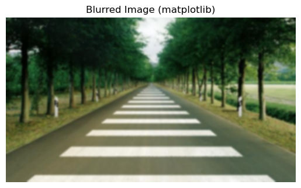
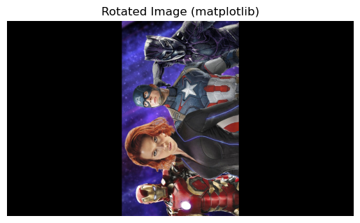

### **Lecture Title:** Introduction to Computer Vision

## 1. **Introduction to Computer Vision**

### Definition:

> **Computer Vision** is a field of Artificial Intelligence (AI) that enables computers to interpret and make decisions based on visual data from the world—like images or videos—just like humans do.

### Explanation:

* Mimics human vision using digital images, videos, and deep learning models.
* Involves image processing, pattern recognition, and machine learning.


## 2. **Core Concepts in Computer Vision**

* **Image Processing** – basic manipulation (contrast, blur, edge detection).
* **Feature Extraction** – identifying key parts (edges, corners, textures).
* **Object Detection** – locating objects in an image (e.g., YOLO, SSD).
* **Image Classification** – labeling an image (e.g., cat, dog).
* **Semantic Segmentation** – identifying each pixel’s category.
* **Pose Estimation** – identifying human joints and posture.


## 3. **Popular Tools and Libraries**

* OpenCV (Open Source Computer Vision Library)
* TensorFlow / PyTorch (for deep learning models)
* YOLO (You Only Look Once)
* MediaPipe (for real-time human pose/face detection)

## 4. **Real-World Applications**

### Healthcare:

* **X-ray/MRI analysis**
* **Tumor detection**
* **Surgical assistance via robotic vision**

### Autonomous Vehicles:

* **Object detection for pedestrians, lanes, vehicles**
* **Traffic sign recognition**
* **Parking assistance**

### Retail & E-Commerce:

* **Virtual try-on systems**
* **Visual product search**
* **Customer footfall analysis via CCTV**

### Smartphones:

* **Face unlock**
* **AR filters on Instagram/Snapchat**
* **Camera enhancements (portrait mode, night mode)**

### Security & Surveillance:

* **Facial recognition**
* **Intruder detection**
* **Number plate recognition**

## 5. **Challenges in Computer Vision**

* Poor lighting or image quality
* Occlusion (partially hidden objects)
* Variation in viewpoint or scale
* Real-time performance requirements
* Bias and fairness (e.g., facial recognition errors)


## 6. **Future of Computer Vision**

* Enhanced AR/VR experiences
* Smarter robotics with vision-based control
* AI-assisted creative tools (image generation/editing)
* Greater use in agriculture, manufacturing, and smart cities


### cv2 Method | matplotlib Method
#### Image Loading


```python
import cv2

image = cv2.imread('marvel_hero_1.jpg')  # Replace with your image path

cv2.imshow('marvel image', image)
cv2.waitKey() # true/false 0/1
cv2.destroyAllWindows()

```


```python
import matplotlib.pyplot as plt
import cv2

image = cv2.imread('marvel_hero_1.jpg')

image_rgb = cv2.cvtColor(image, cv2.COLOR_BGR2RGB)

plt.imshow(image_rgb)
plt.title("Image Loaded (matplotlib)")
plt.axis('off')
plt.show()

```


    

    


#### Grayscale Conversion


```python
import cv2

image = cv2.imread('marvel_hero_3.jpg')  # Replace with your image path

gray_image = cv2.cvtColor(image, cv2.COLOR_BGR2GRAY)

cv2.imshow('Grayscale Image (cv2)', gray_image)
cv2.waitKey(0)
cv2.destroyAllWindows()

```


```python
import cv2
import matplotlib.pyplot as plt

image = cv2.imread('marvel_hero_3.jpg')  # Replace with your image path

gray_image = cv2.cvtColor(image, cv2.COLOR_BGR2GRAY)
# gray_image = cv2.cvtColor(image, cv2.COLOR_BGR2Luv) # high contrast color
# gray_image = cv2.cvtColor(image, cv2.COLOR_BGR2Luv) # high contrast color
gray_image = cv2.cvtColor(image, cv2.COLOR_RGB2BGR)
# gray_image = cv2.cvtColor(image, cv2.COLOR_BGR2RGB)

# rgb_image = cv2.cvtColor(image, cv2.GRAY2BGR)

# plt.imshow(gray_image)
plt.imshow(gray_image, cmap='gray')
plt.title("Grayscale Image (matplotlib)")
plt.axis('off')
plt.show()

```


    

    


#### Resize Image


```python
import cv2
import numpy

image = cv2.imread(r"sea.jpg")

size = image.shape
height,width = image.shape[:2]

print("Size of image: ",size)

print(height)
print(width)
```

    Size of image:  (774, 1326, 3)
    774
    1326
    


```python
import cv2

image = cv2.imread('sea.jpg')  # Replace with your image path

resized_image = cv2.resize(image, (800, 700))  # Resize to 400x400

cv2.imshow('Resized Image (cv2)', resized_image)
cv2.waitKey(0)
cv2.destroyAllWindows()

```


```python
import cv2
import matplotlib.pyplot as plt

image = cv2.imread('marvel_hero_1.jpg')  # Replace with your image path

resized_image = cv2.resize(image, (800, 700))  # Resize to 400x400

plt.imshow(cv2.cvtColor(resized_image, cv2.COLOR_BGR2RGB))
plt.title("Resized Image (matplotlib)")
plt.axis('off')
plt.show()

```


    

    


#### Image Cropping


```python
import cv2

image = cv2.imread('zebra-crossing.jpg')  # Replace with your image path

print(image.shape[:2])
```

    (299, 525)
    


```python
import cv2

image = cv2.imread('marvel_hero_3.jpg')  # Replace with your image path

cropped_image = image[500:720, 200:1280] # Crop a region
cv2.imshow('Cropped Image (cv2)', cropped_image)
cv2.waitKey(0)
cv2.destroyAllWindows()
```


```python
import cv2

list_image = ["marvel_hero_1.jpg","sea.jpg","zebra-crossing.jpg",
             "marvel_hero_2.jpg","eye.jpg", "blur_image.jpg"]
dict_img_size = {}
counter = 1
for i in list_image:
    img = cv2.imread(i)
    # if img is None:
    #     print(f"Error: Could not load image '{i}'")
    #     continue
    w,h = img.shape[:2]
    dict_img_size[f'img{counter}']=[w,h]
    crop = img[200:w, 200:h]
    cv2.imshow(f"{i}", crop)
    cv2.waitKey(0)
    cv2.destroyAllWindows()
    counter+=1

print(dict_img_size)
```


```python
import cv2

image = cv2.imread('marvel_hero_3.jpg')

height, width = image.shape[:2]

crop_width, crop_height = 200, 200

# Calculate starting points
x_start = width // 2 - crop_width // 2  # center x - half width
y_start = height // 2 - crop_height // 2  # center y - half height


cropped = image[y_start:y_start+crop_height, x_start:x_start+crop_width]

# Show or save the result
cv2.imshow("Cropped", cropped)
cv2.waitKey(0)
cv2.destroyAllWindows()

```


```python
import cv2
import matplotlib.pyplot as plt

image = cv2.imread('marvel_hero_3.jpg')  # Replace with your image path

cropped_image = image[500:720, 200:1280] # Crop a region

plt.imshow(cv2.cvtColor(cropped_image, cv2.COLOR_BGR2RGB))
plt.title("Cropped Image (matplotlib)")
plt.axis('off')
plt.show()

```


    

    


#### Edge Detection (Canny)


```python
import cv2

image = cv2.imread('zebra-crossing.jpg')  # Replace with your image path
# image = cv2.imread('marvel_hero_2.jpg')  # Replace with your image path

gray_image = cv2.cvtColor(image, cv2.COLOR_BGR2GRAY)

edges = cv2.Canny(gray_image, 100, 200)

cv2.imshow('Edge Detection (cv2)', edges)
cv2.waitKey(0)
cv2.destroyAllWindows()

```


```python
import cv2
import matplotlib.pyplot as plt

image = cv2.imread('digit_with_spot.jpg')  # Replace with your image path
# image = cv2.imread('marvel_hero_2.jpg')  # Replace with your image path

gray = cv2.cvtColor(image, cv2.COLOR_BGR2GRAY)

plt.imshow(gray, cmap="gray")
plt.title("Edge Detection (matplotlib)")
plt.axis('off')
plt.show()

```


    

    


#### Gaussian Blurring


```python
import cv2

image = cv2.imread('zebra-crossing.jpg')  # Replace with your image path

gray_image = cv2.cvtColor(image, cv2.COLOR_BGR2GRAY)

blurred_image = cv2.GaussianBlur(image, (15, 15), 0)

cv2.imshow('Blurred Image (cv2)', blurred_image)
cv2.waitKey(0)
cv2.destroyAllWindows()

```


```python
import cv2

image = cv2.imread('zebra-crossing.jpg')  # Replace with your image path

gray_image = cv2.cvtColor(image, cv2.COLOR_BGR2GRAY)

# blurred_image = cv2.GaussianBlur(image, (5, 5), 0) # normal use case in AI application
blurred_image = cv2.GaussianBlur(image, (7, 7), 0) # normal use case in AI application

plt.imshow(cv2.cvtColor(blurred_image, cv2.COLOR_BGR2RGB))
plt.title("Blurred Image (matplotlib)")
plt.axis('off')
plt.show()

```


    

    


```python
# (3, 3): Light blur, for removing minor noise.
# (5, 5): Moderate blur, for softening details a little.
# (7, 7): Strong blur, common for significant smoothing effects.
# (15, 15): Very strong blur, for heavy noise removal or artistic effects.

import cv2
import numpy as np
import matplotlib.pyplot as plt


image = cv2.imread("zebra-crossing.jpg")
image_rgb = cv2.cvtColor(image, cv2.COLOR_BGR2RGB)

blur_3x3 = cv2.GaussianBlur(image_rgb, (3, 3), 0)
blur_5x5 = cv2.GaussianBlur(image_rgb, (5, 5), 0)
blur_7x7 = cv2.GaussianBlur(image_rgb, (7, 7), 0)
blur_15x15 = cv2.GaussianBlur(image_rgb, (15, 15), 0)

plt.figure(figsize=(12, 10))

plt.subplot(3, 2, 1)
plt.imshow(image_rgb)
plt.title("Original Image")
plt.axis('off')

plt.subplot(3, 2, 2)
plt.imshow(blur_3x3)
plt.title("Gaussian Blur (3x3)")
plt.axis('off')

plt.subplot(3, 2, 3)
plt.imshow(blur_5x5)
plt.title("Gaussian Blur (5x5)")
plt.axis('off')

plt.subplot(3, 2, 4)
plt.imshow(blur_7x7)
plt.title("Gaussian Blur (7x7)")
plt.axis('off')

plt.subplot(3, 2, 5)
plt.imshow(blur_15x15)
plt.title("Gaussian Blur (15x15)")
plt.axis('off')


plt.show()

```


    

    


#### Thresholding


```python
import cv2

image = cv2.imread('digit_with_spot.jpg')  # Replace with your image path

gray_image = cv2.cvtColor(image, cv2.COLOR_BGR2GRAY)

# 127 is the threshold value, 255 is the max value, and 0 is the min value (black)
_, threshold_image = cv2.threshold(gray_image, 127, 255, cv2.THRESH_BINARY)
# _, threshold_image = cv2.threshold(gray_image, 127, 255, cv2.THRESH_BINARY_INV)
# _, threshold_image = cv2.threshold(gray_image, 127, 255, cv2.THRESH_TRUNC)
# _, threshold_image = cv2.threshold(gray_image, 127, 255, cv2.THRESH_TOZERO)
# _, threshold_image = cv2.threshold(gray_image, 127, 255, cv2.THRESH_TOZERO_INV)

cv2.imshow('Threshold Image (cv2)', threshold_image)
cv2.waitKey(0)
cv2.destroyAllWindows()

```


```python
import cv2

image = cv2.imread('digit_with_spot.jpg')  # Replace with your image path

gray_image = cv2.cvtColor(image, cv2.COLOR_BGR2GRAY)

# Apply Adaptive Thresholding
adaptive_thresholded_image = cv2.adaptiveThreshold(gray_image, 255, 
                                                  cv2.ADAPTIVE_THRESH_GAUSSIAN_C,
                                                  cv2.THRESH_BINARY, 11, 2)
# adaptive_thresholded_image = cv2.adaptiveThreshold(gray_image, 255, 
#                                                   cv2.ADAPTIVE_THRESH_MEAN_C,
#                                                   cv2.THRESH_BINARY, 11, 2)

# Show the result
cv2.imshow("Adaptive Thresholded Image", adaptive_thresholded_image)
cv2.waitKey(0)
cv2.destroyAllWindows()

```


```python
# import cv2
import matplotlib.pyplot as plt

# image = cv2.imread('digit_with_spot.jpg')  # Replace with your image path

# gray_image = cv2.cvtColor(image, cv2.COLOR_BGR2GRAY)

# _, threshold_image = cv2.threshold(gray_image, 127, 255, cv2.THRESH_BINARY)

import cv2

image = cv2.imread('digit_with_spot.jpg')  # Replace with your image path

gray_image = cv2.cvtColor(image, cv2.COLOR_BGR2GRAY)

# Apply Adaptive Thresholding
adaptive_thresholded_image = cv2.adaptiveThreshold(gray_image, 255, 
                                                  cv2.ADAPTIVE_THRESH_GAUSSIAN_C,
                                                  cv2.THRESH_BINARY, 11, 2)

plt.imshow(adaptive_thresholded_image,cmap='gray')
plt.title("Threshold Image (matplotlib)")
plt.axis('off')
plt.show()

```


    

    


```python
import cv2
import matplotlib.pyplot as plt

image = cv2.imread('old-newspaper-vector.jpg')  # Replace with your image path

gray_image = cv2.cvtColor(image, cv2.COLOR_BGR2GRAY)

# Apply Adaptive Thresholding
adaptive_thresholded_image = cv2.adaptiveThreshold(gray_image, 255, 
                                                  cv2.ADAPTIVE_THRESH_GAUSSIAN_C,
                                                  cv2.THRESH_BINARY, 11, 2)
# adaptive_thresholded_image = cv2.adaptiveThreshold(gray_image, 255, 
#                                                   cv2.ADAPTIVE_THRESH_MEAN_C,
#                                                   cv2.THRESH_BINARY, 11, 2)

# Show the result
plt.imshow(adaptive_thresholded_image, cmap="gray")
plt.title("Adaptive Threshold Image (matplotlib)")
plt.axis('off')
plt.show()
```


    

    


#### Blur with Median Filter


```python
import cv2

image = cv2.imread('marvel_hero_3.jpg')  # Replace with your image path

gray_image = cv2.cvtColor(image, cv2.COLOR_BGR2GRAY)

median_blurred_image = cv2.medianBlur(gray_image, 9)

cv2.imshow("Original Image", gray_image)
cv2.imshow("Median Blurred Image", median_blurred_image)
cv2.waitKey(0)
cv2.destroyAllWindows()

```


```python
import cv2
import matplotlib.pyplot as plt

image = cv2.imread('marvel_hero_3.jpg')  # Replace with your image path

gray_image = cv2.cvtColor(image, cv2.COLOR_BGR2GRAY)

median_blurred_image = cv2.medianBlur(gray_image, 9)

plt.figure(figsize=(12,12))

plt.subplot(1, 2, 1)
plt.imshow(gray_image, cmap='gray')
plt.title("Original Image")
plt.axis('off')

plt.subplot(1, 2, 2)
plt.imshow(cv2.cvtColor(median_blurred_image, cv2.COLOR_BGR2RGB))
plt.title("Median Blurred Image")
plt.axis('off')

plt.show()
```


    

    


#### Rotation


```python
import cv2
import matplotlib.pyplot as plt

image = cv2.imread('marvel_hero_3.jpg')  # Replace with your image path


(height, width) = image.shape[:2]
center = (width // 2, height // 2)

rotation_matrix = cv2.getRotationMatrix2D(center, 45, 1.0)
rotated_image = cv2.warpAffine(image, rotation_matrix, (width, height))

cv2.imshow('Rotated Image (cv2)', rotated_image)
cv2.waitKey(0)
cv2.destroyAllWindows()

```


```python
import cv2
import matplotlib.pyplot as plt

image = cv2.imread('marvel_hero_3.jpg')  # Replace with your image path


(height, width) = image.shape[:2]
center = (width // 2, height // 2)

rotation_matrix = cv2.getRotationMatrix2D(center, 90, 0.6)
rotated_image = cv2.warpAffine(image, rotation_matrix, (width, height))

plt.imshow(cv2.cvtColor(rotated_image, cv2.COLOR_BGR2RGB))
plt.title("Rotated Image (matplotlib)")
plt.axis('off')
plt.show()

```


    

    


#### Face Detection


```python
import cv2
import matplotlib.pyplot as plt

image = cv2.imread('marvel_hero_1.jpg')  # Replace with your image path

face_cascade = cv2.CascadeClassifier(cv2.data.haarcascades +
                                     'haarcascade_frontalface_default.xml')

gray = cv2.cvtColor(image, cv2.COLOR_BGR2GRAY)

faces = face_cascade.detectMultiScale(gray, scaleFactor=1.1, 
                                      minNeighbors=5, minSize=(30, 30))

# print(faces)
# print(len(faces))
for (x, y, w, h) in faces:
    cv2.rectangle(image, (x, y), 
                  (x+w, y+h), (0, 255, 0), 2)
cv2.imshow('Face Detection (cv2)', image)
cv2.waitKey(0)
cv2.destroyAllWindows()

```


```python
import cv2
import matplotlib.pyplot as plt

image = cv2.imread('marvel_hero_2.jpg')  # Replace with your image path

face_cascade = cv2.CascadeClassifier(cv2.data.haarcascades + 'haarcascade_frontalface_default.xml')

gray = cv2.cvtColor(image, cv2.COLOR_BGR2GRAY)

faces = face_cascade.detectMultiScale(gray, scaleFactor=1.1, minNeighbors=5, minSize=(30, 30))

for (x, y, w, h) in faces:
    cv2.rectangle(image, (x, y), (x+w, y+h), (0, 255, 0), 6)

plt.imshow(cv2.cvtColor(image, cv2.COLOR_BGR2RGB))
plt.title("Face Detection (matplotlib)")
plt.axis('off')
plt.show()
```


    

    


```python
import os
print(os.listdir())

```

    ['.ipynb_checkpoints', 'blur_image.jpg', 'cv2_lectures.ipynb', 'digit_with_spot.jpg', 'elon.jpg', 'eye.jpg', 'haarcascade_frontalface_default.xml', 'marvel_hero_1.jpg', 'marvel_hero_2.jpg', 'marvel_hero_3.jpg', 'old-newspaper-vector.jpg', 'road.jpg', 'sea.jpg', 'tony_and_steve.jpg', 'zebra-crossing.jpg']
    


```python
import cv2
import matplotlib.pyplot as plt

image = cv2.imread('tony_and_steve.jpg')  # Replace with your image path

face_cascade = cv2.CascadeClassifier(cv2.data.haarcascades + 
                                     'haarcascade_frontalface_default.xml')

gray = cv2.cvtColor(image, cv2.COLOR_BGR2GRAY)

faces = face_cascade.detectMultiScale(gray, scaleFactor=1.1,
                                      minNeighbors=5, minSize=(30, 30))

if len(faces) > 0:
    x, y, w, h = faces[0]
    
    cv2.rectangle(image, (x, y), (x+w, y+h), (0, 255, 0), 8)
    
    image_rgb = cv2.cvtColor(image, cv2.COLOR_BGR2RGB)
    
    plt.imshow(image_rgb)
    plt.title("Single Face Detection")
    plt.axis("off")
    plt.show()
else:
    print("No face detected")

```


    

    

