# Learn-Computer-Vision

# <div class='jumbotron alert-success'><h1>Computer Vision (OpenCV)</h1></div>


# `Introduction:`
OpenCV is a huge open-source library for computer vision, machine learning, and image processing. It can process images and videos to identify objects, faces, or even the handwriting of a human.

# `Anaconda prompt and type the following command.`

# `conda install -c conda-forge opencv`


`Press the Enter button and it will download all the related OpenCV configuration.`


# `Install OpenCV in the Windows via pip`

`OpenCV is a Python library so it is necessary to install Python in the system and install OpenCV using pip command:`

# `pip install opencv-contrib-python --upgrade`

`We can install it without extra modules by the following command:`

# `pip install opencv-python`


Open the command prompt and type the following code to check if the OpenCV is installed or not.


# `Let's Start Coding:`

# `- How to Load and Display an Image`

# `1st Method`


```python
from matplotlib import pyplot as plt # import library
import numpy as np # import library
import cv2 # import library

img = cv2.imread(r"car.jpg") # It is used to load an image in the Python program

# The imshow() function in pyplot module of matplotlib library is used
# to display data as an image; i.e. on a 2D regular raster.
plt.imshow(img) 
```


    <matplotlib.image.AxesImage at 0x2021925cb20>


    
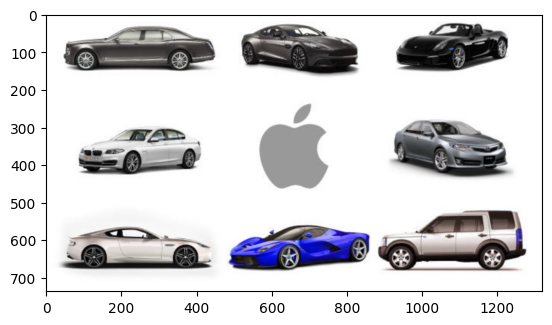
    


# `- How to Resize Images`


```python
from matplotlib import pyplot as plt # import library
import numpy as np # import library
import cv2 # import library

img = cv2.imread("car.jpg") # It is used to load an image in the Python program

increase = cv2.resize(img,(250,250))
# The imshow() function in pyplot module of matplotlib library is used
# to display data as an image; i.e. on a 2D regular raster.
plt.imshow(increase) # for increase image size
```


    <matplotlib.image.AxesImage at 0x2021bd207c0>


    
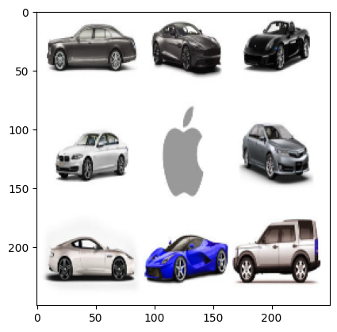
    


```python
from matplotlib import pyplot as plt # import library
import numpy as np # import library
import cv2 # import library

img = cv2.imread("car.jpg") # It is used to load an image in the Python program

decrease = cv2.resize(img,(200,300))
increase = cv2.resize(img,(2500,1100))
# The imshow() function in pyplot module of matplotlib library is used
# to display data as an image; i.e. on a 2D regular raster.
# plt.imshow(decrease) # for increase image size
# plt.imshow(decrease)

plt.subplot(121),plt.imshow(decrease),plt.title("Decrease")
plt.subplot(122),plt.imshow(increase),plt.title("Increase")

```


    (<Axes: title={'center': 'Increase'}>,
     <matplotlib.image.AxesImage at 0x2021bd20220>,
     Text(0.5, 1.0, 'Increase'))


    
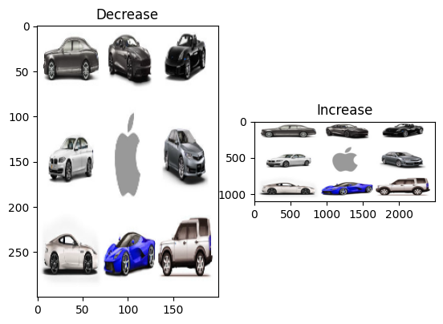
    


```python
from matplotlib import pyplot as plt # import library
import numpy as np # import library
import cv2 # import library

img = cv2.imread("road.jpg") # It is used to load an image in the Python program

decrease = cv2.resize(img,(200,300))
increase = cv2.resize(img,(2500,1100))
# The imshow() function in pyplot module of matplotlib library is used
# to display data as an image; i.e. on a 2D regular raster.

plt.subplot(121),plt.imshow(decrease),plt.title("Decrease")
plt.subplot(122),plt.imshow(increase),plt.title("Increase")

```


    (<Axes: title={'center': 'Increase'}>,
     <matplotlib.image.AxesImage at 0x2021be25cd0>,
     Text(0.5, 1.0, 'Increase'))


    
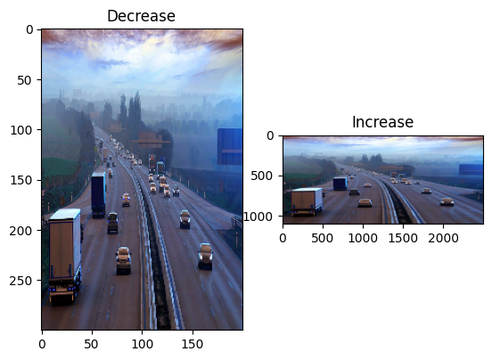
    


# `- How to Rotate Images`


```python
from matplotlib import pyplot as plt # import library
import numpy as np # import library
import cv2 # import library

img = cv2.imread("chess.jpg") # It is used to load an image in the Python program

rotate_clockwise1 = cv2.rotate(img, cv2.ROTATE_90_CLOCKWISE)

rotate_clockwise2 = cv2.rotate(img, cv2.ROTATE_90_COUNTERCLOCKWISE)

# rotate_clockwise = cv2.rotate(img, cv2.ROTATE_180)

# plt.imshow(rotate_clockwise)
plt.subplot(121),plt.imshow(rotate_clockwise1)
plt.subplot(122),plt.imshow(rotate_clockwise2)
```


    (<Axes: >, <matplotlib.image.AxesImage at 0x2021bf203d0>)


    
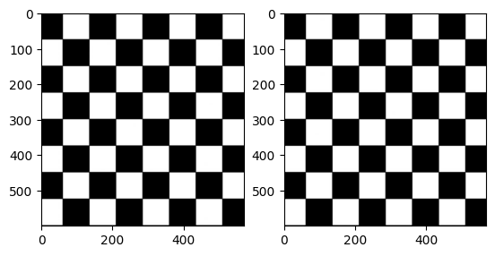
    


# `- How to Draw On an Image`


```python
from matplotlib import pyplot as plt # import library
import numpy as np # import library
import cv2 # import library

img = cv2.imread("elon.jpg") # It is used to load an image in the Python program

start = (700,0) # x , y cordinate
end = (1200,1500) # x , y cordinate
color = (0,255,0) # color code
thickness = (100) # thickness

draw_line = cv2.line(img, start,end,color,thickness)

plt.imshow(draw_line)
```


    <matplotlib.image.AxesImage at 0x2021bf8fb50>


    
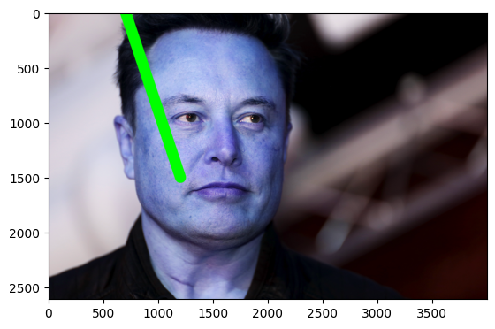
    


# Circle


```python
from matplotlib import pyplot as plt # import library
import numpy as np # import library
import cv2 # import library

img = cv2.imread("iron_man.jpg") # It is used to load an image in the Python program

start = (600,600) # x , y cordinate
color = (0,255,0) # color code
circle_size = 500
thickness = 40 # thickness

draw_line = cv2.circle(img,start,circle_size, color, thickness)

plt.imshow(draw_line)
```


    <matplotlib.image.AxesImage at 0x2021bf60d60>


    
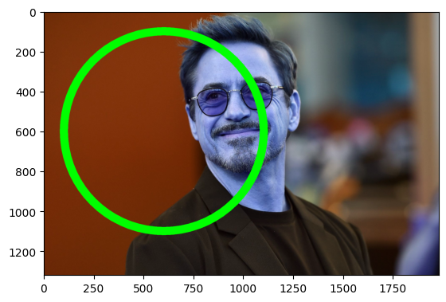
    


# rectangle


```python
# import numpy as np  
import cv2  
import matplotlib.pyplot as plt

img = cv2.imread("elon.jpg")  

cordinate = (2000,1500) # x, y
cordinate_end = (1000,400) # x, y

color = (0,255,0)

draw_rec = cv2.rectangle(img,cordinate, cordinate_end, color, 50)  

plt.imshow(draw_rec)
```


    <matplotlib.image.AxesImage at 0x2021c1f6670>


    
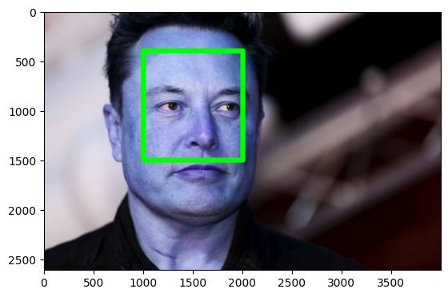
    


```python
# import numpy as np  
import cv2  
import matplotlib.pyplot as plt

img = cv2.imread("elon.jpg")  

draw_rec = cv2.rectangle(img,(2000,1500), (1000,400), (0,150,200), 50)  

plt.imshow(draw_rec)
```


    <matplotlib.image.AxesImage at 0x2021c117bb0>


    
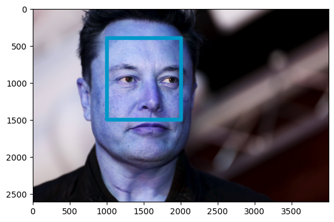
    


# ellipse


```python
# import numpy as np  
import cv2  
img = cv2.imread(r"image.jpg",1)  
  
draw_ellip = cv2.ellipse(img, (550, 550), (380, 320), 10, 0, 70, (0,0,0), -1)  

plt.imshow(draw_ellip)
```


    <matplotlib.image.AxesImage at 0x2021c18c2b0>


    
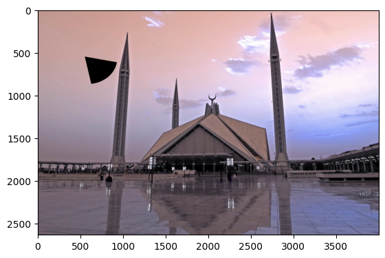
    


# polyline


```python
import matplotlib.pyplot as plt
import numpy as np  
import cv2  
img = cv2.imread('elon.jpg',cv2.IMREAD_COLOR)  
#defining points for polylines  
pts = np.array([[300,250],[400,300],[700,200],[500,100]], np.int32)  
# pts = pts.reshape((-1,1,2))  
draw_poly = cv2.polylines(img, [pts], True, (0,255,0), 30)  

plt.imshow(draw_poly)
```


    <matplotlib.image.AxesImage at 0x2021c255490>


    
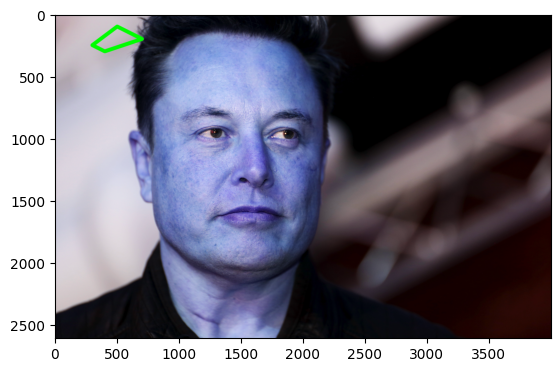
    


```python
import matplotlib.pyplot as plt
import cv2  
img = cv2.imread(r'image.jpg',cv2.IMREAD_COLOR) 
cv2.putText(img, "Faisal Masjid", (250,500),
            cv2.FONT_HERSHEY_SIMPLEX, 15, (80, 155, 40), 30)

plt.imshow(img)
plt.show()
```


    
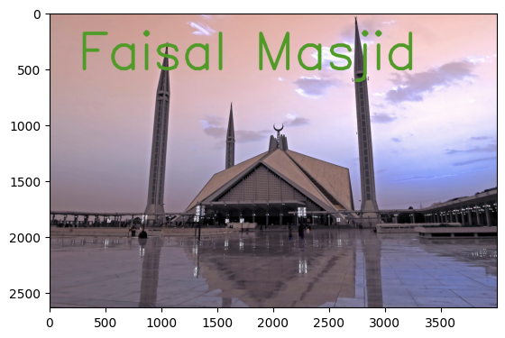
    


```python
import cv2
import numpy as np
import matplotlib.pyplot as plt

img_size = 255 * np.ones(shape=[1012, 1012, 3], dtype=np.uint8)


cv2.putText(img_size, text='Python with OpenCV', org=(100,200),
            fontFace= cv2.FONT_HERSHEY_SIMPLEX, fontScale=2, color=(0,0,0),
            thickness=6, lineType=cv2.LINE_AA)


plt.imshow(img_size)

plt.show()
```


    
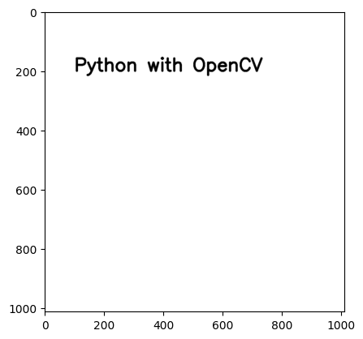
    


# `- How to Convert an Image to Grayscale`


```python
from matplotlib import pyplot as plt # import library
import numpy as np # import library
import cv2 # import library

img = cv2.imread("road.jpg") # It is used to load an image in the Python program

gray = cv2.cvtColor(img, cv2.COLOR_BGR2GRAY)

plt.imshow(gray)
```


    <matplotlib.image.AxesImage at 0x2021c59c190>


    
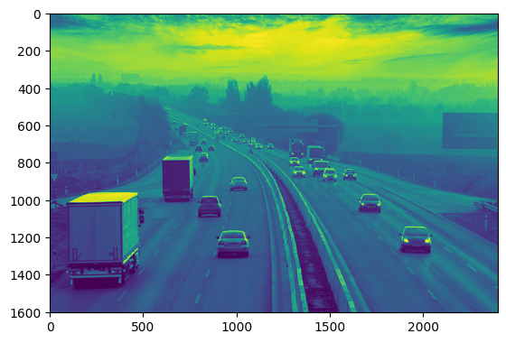
    


```python
from matplotlib import pyplot as plt # import library
import numpy as np # import library
import cv2 # import library

img = cv2.imread("road.jpg") # It is used to load an image in the Python program

grayscale = cv2.cvtColor(img, cv2.COLOR_BGR2Luv)

plt.imshow(grayscale)
```


    <matplotlib.image.AxesImage at 0x2021c65b100>


    
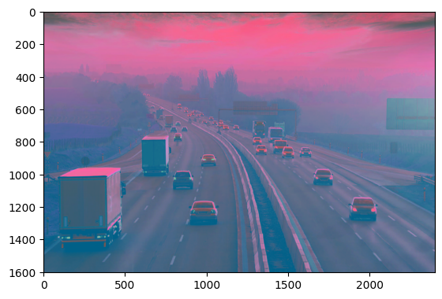
    


# `- What is Thresholding?`
In image processing, image thresholding is a necessary intermediary step. It helps remove contours and darker or lighter regions of images. 


```python
from matplotlib import pyplot as plt # import library
import numpy as np # import library
import cv2 # import library

img = cv2.imread("iron_man.jpg") # It is used to load an image in the Python program

ret, threshold_binary = cv2.threshold(img,150,250,cv2.THRESH_BINARY)

plt.imshow(threshold_binary)
```


    <matplotlib.image.AxesImage at 0x2021c7143d0>


    
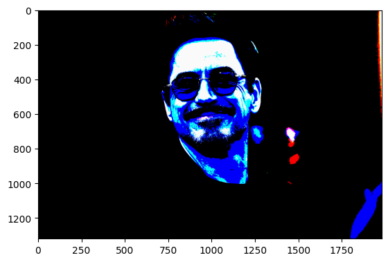
    


# `- Understanding Edge Detection`
Edge detection is an effective segmentation mechanism used to find the boundaries of objects of an image.

# <div class='jumbotron alert-success'>2nd Mehtod</div>

# `cv2 imread()`


```python
from matplotlib import pyplot as plt # import library
import numpy as np # import library
import cv2 # import library

img = cv2.imread("marvel.jpg") # It is used to load an image in the Python program

edge = cv2.Canny(img,50,50)

# plt.imshow(edge)

cv2.imshow('Image to Egde',edge)
cv2.waitKey(0)
cv2.destroyAllWindows()
```


# Finding image size


```python
# Importing the OpenCV library
import cv2
# Reading the image using imread() function
image = cv2.imread('road.jpg')

# Extracting the height and width of an image
h, w = image.shape[:2]
# Displaying the height and width
print("Height = {}, Width = {}".format(h, w))

```

    Height = 1603, Width = 2400
    


```python
# Python code to read image
import cv2

# To read image from disk, we use
# cv2.imread function, in below method,
img = cv2.imread("marvel.jpg", cv2.IMREAD_COLOR)

# Creating GUI window to display an image on screen
# first Parameter is windows title (should be in string format)
# Second Parameter is image array
cv2.imshow("image", img)

# To hold the window on screen, we use cv2.waitKey method
# Once it detected the close input, it will release the control
# To the next line
# First Parameter is for holding screen for specified milliseconds
# It should be positive integer. If 0 pass an parameter, then it will
# hold the screen until user close it.
cv2.waitKey(0)

# It is for removing/deleting created GUI window from screen
# and memory
cv2.destroyAllWindows()

```

 

# grayscale mode


```python
# Python program to explain cv2.imread() method
# importing cv2
import cv2

# path
path = "eye3.jpg"

# Using cv2.imread() method
# Using 0 to read image in grayscale mode
img = cv2.imread(path,0)

# Displaying the image
cv2.imshow('image', img)
cv2.waitKey(0)
cv2.destroyAllWindows()

```


```python
#importing the opencv module  
import cv2  
  
# using imread('path') and 0 denotes read as  grayscale image  
img = cv2.imread("eye3.jpg",1)  
  
#This is using for display the image  
cv2.imshow('image',img)  
  
cv2.waitKey(0) # This is necessary to be required so that the image doesn't close immediately.  
#It will run continuously until the key press.  
cv2.destroyAllWindows()  
```


# `Drawing Functions`


```python
# import numpy as np  
import cv2  # import library

img = cv2.imread(r"img.jpg",1) # add image in imread() function  

cordinate = (58,50) # define cordinate for where we plant circle

color = (0,255,0) # define color

radius = 22 # define radius

cv2.circle(img,cordinate, radius, color, 5)  

cv2.imshow('image',img)  

cv2.waitKey(0)  
cv2.destroyAllWindows()  
```

 


```python
# import numpy as np  
import cv2  

img = cv2.imread(r"marvel.jpg",1)  

cordinate = (58,50) # x, y

color = (0,255,0)

radius = (200,100) # x, y

cv2.rectangle(img,cordinate, radius, color, 2)  

cv2.imshow('image',img)  

cv2.waitKey(0)  

cv2.destroyAllWindows()  
```


```python
import numpy as np  
import cv2  
img = cv2.imread(r"eye3.jpg",1)  
cv2.rectangle(img,(15,25),(200,150),(0,255,255),15)  
cv2.imshow('image',img)  
cv2.waitKey(0)  
cv2.destroyAllWindows()  
```


```python
import numpy as np  
import cv2  
img = cv2.imread(r"marvel_3.jpg",1)  
  
cv2.ellipse(img, (250, 150), (80, 20), 5, 0, 360, (0,0,255), -1)  
cv2.imshow('image',img)  
cv2.waitKey(0)  
cv2.destroyAllWindows()  
```


```python
import numpy as np  
import cv2  
img = cv2.imread(r"img.jpg",1)  
cv2.line(img,(10,0),(150,150),(0,200,0),15)  
cv2.imshow('image',img)  
cv2.waitKey(0)  
cv2.destroyAllWindows()  
```


```python
import numpy as np  
import cv2  
img = cv2.imread(r'eye3.jpg',cv2.IMREAD_COLOR)  
#defining points for polylines  
pts = np.array([[100,50],[200,300],[700,200],[500,100]], np.int32)  
# pts = pts.reshape((-1,1,2))  
cv2.polylines(img, [pts], True, (0,255,255), 3)  
cv2.imshow('image',img)  
cv2.waitKey(0)  
cv2.destroyAllWindows()  
```


# Type of Font


# function clearification


```python
import numpy as np  
import cv2  
img = cv2.imread(r'marvel.jpg',cv2.IMREAD_COLOR) 
cv2.putText(img, "OpenCV + Marvel Heroes", (10, 25),
            cv2.FONT_HERSHEY_SIMPLEX, 0.7, (0, 255, 0), 2)
cv2.imshow("Text", img)
cv2.waitKey(0)
cv2.destroyAllWindows()  
```


# `Line detection in python`


```python
import cv2
import numpy as np
import matplotlib.pyplot as plt

# Read image
image = cv2.imread('chess.jpg')

# Convert image to grayscale
gray = cv2.cvtColor(image,cv2.COLOR_BGR2GRAY)

# Use canny edge detection
edges = cv2.Canny(gray,50,150,apertureSize=3)

# Apply HoughLinesP method to
# to directly obtain line end points
lines_list =[]
lines = cv2.HoughLinesP(
            edges, # Input edge image
            1, # Distance resolution in pixels
            np.pi/180, # Angle resolution in radians
            threshold=100, # Min number of votes for valid line
            minLineLength=5, # Min allowed length of line
            maxLineGap=10 # Max allowed gap between line for joining them
            )

# Iterate over points
for points in lines:
    # Extracted points nested in the list
    x1,y1,x2,y2=points[0]
    # Draw the lines joing the points
    # On the original image
    cv2.line(image,(x1,y1),(x2,y2),(255,0,0),8)
    # Maintain a simples lookup list for points
    lines_list.append([(x1,y1),(x2,y2)])
    
plt.imshow(image)

```


    <matplotlib.image.AxesImage at 0x2021c798b50>


    
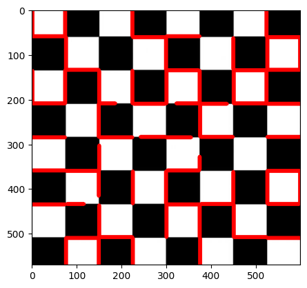
    


# `Detect corner of an image`


```python
# import the required library
import numpy as np
import cv2
from matplotlib import pyplot as plt


# read the image
img = cv2.imread('corner.png')

# convert image to gray scale image
gray = cv2.cvtColor(img, cv2.COLOR_BGR2GRAY)

# detect corners with the goodFeaturesToTrack function.
corners = cv2.goodFeaturesToTrack(gray, 27, 0.01, 10)
corners = np.int0(corners)

# we iterate through each corner,
# making a circle at each point that we think is a corner.
for i in corners:
    x, y = i.ravel()
    cv2.circle(img, (x, y), 3, 255, -1)

plt.imshow(img), plt.show()

```


    
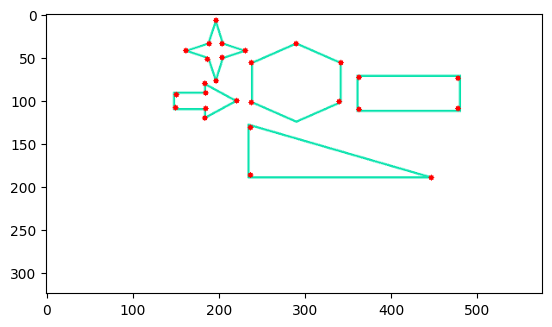
    


    (<matplotlib.image.AxesImage at 0x2021bde2d60>, None)


# `Let's Start Face Detection`

`before we start we need haarcascade file for face, eye, number plate, emotion, full body, smile etc... detections`

`goto this link and download this file which is selected` 

https://github.com/MuhammadRaheelNaseem/OpenCV-Cascade-Files/tree/4.x/data/haarcascades


```python
import matplotlib.pyplot as plt
import cv2
# Load the cascade
face_cascade = cv2.CascadeClassifier('haarcascade_frontalface_default.xml')
# Read the input image
img = cv2.imread('marvel.jpg')
# Convert into grayscale
gray = cv2.cvtColor(img, cv2.COLOR_RGB2BGR)
# Detect faces
faces = face_cascade.detectMultiScale(gray, 1.1, 4)
# Draw rectangle around the faces
for (x, y, w, h) in faces:
    cv2.rectangle(img, (x, y), (x+w, y+h), (0, 255, 0), 4)
# Display the output
# cv2.imwrite("abcdefg.jpg",faces)
plt.imshow(img)
```


    <matplotlib.image.AxesImage at 0x2021bdcad30>


    
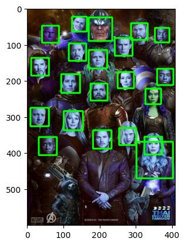
    


```python

import cv2
import sys

# Get user supplied values
imagePath = sys.argv[1]
cascPath = "haarcascade_frontalface_default.xml"

# Create the haar cascade
faceCascade = cv2.CascadeClassifier(cascPath)

# Read the image
image = cv2.imread(r'marvel.jpg')
gray = cv2.cvtColor(image, cv2.COLOR_BGR2GRAY)

# Detect faces in the image
faces = faceCascade.detectMultiScale(
    gray,
    scaleFactor=1.1,
    minNeighbors=5,
    minSize=(30, 30)
)

print("Found {0} faces!".format(len(faces)))

# Draw a rectangle around the faces
for (x, y, w, h) in faces:
    cv2.rectangle(image, (x, y), (x+w, y+h), (0, 255, 0), 2)

cv2.imshow("Faces found", image)
cv2.waitKey(0)
cv2.destroyAllWindows()
```

    Found 21 faces!
    


```python
import cv2
import matplotlib.pyplot as plt


cascPath = "haarcascade_frontalface_default.xml"

# Create the haar cascade
faceCascade = cv2.CascadeClassifier(cascPath)

# Read the image
image = cv2.imread("facess.png")
gray = cv2.cvtColor(image, cv2.COLOR_BGR2GRAY)

# Detect faces in the image
faces = faceCascade.detectMultiScale(
    gray,
    scaleFactor=1.1,
    minNeighbors=5,
    minSize=(30, 30)
)

print("Found {0} faces!".format(len(faces)))

# Draw a rectangle around the faces
for (x, y, w, h) in faces:
    cv2.rectangle(image, (x, y), (x+w, y+h), (0, 255, 0), 2)

plt.imshow(image)
```

    Found 8 faces!
    


    <matplotlib.image.AxesImage at 0x2021c103460>


    
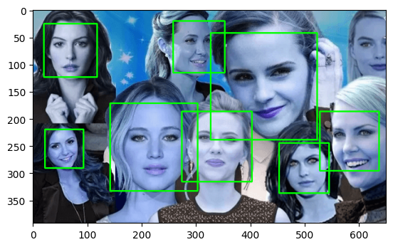
    


# `Video Detection`


```python
import cv2  
import sys

# im = cv2.imread("/img.jpg", 1)
  
# Load the cascade  
face_cascade = cv2.CascadeClassifier('haarcascade_frontalface_default.xml')  
  
# To capture video from webcam.   
# cap = cv2.VideoCapture(0)  # for camera
cap = cv2.VideoCapture("face.mp4")  # for video

  
while True:  
    # Read the frame  
    _, img = cap.read()  
  
    # Convert to grayscale  
    gray = cv2.cvtColor(img, cv2.COLOR_BGR2GRAY)  
  
    # Detect the faces  
    faces = face_cascade.detectMultiScale(gray, 1.1, 4)  
  
    # Draw the rectangle around each face  
    for (x, y, w, h) in faces:  
        cv2.rectangle(img, (x, y), (x+w, y+h), (255, 0, 0), 2)  
  
    # Display  
    cv2.imshow('Video', img)  
  
    # Stop if escape key is pressed  
    k = cv2.waitKey(30) & 0xff  
    if k==27:  
        break  
          
# Release the VideoCapture object  
```

# Video Output:


```python
import cv2  
  
# Load the cascade  
face_cascade = cv2.CascadeClassifier('haarcascade_frontalface_default.xml')  
# To capture video from existing video.   
cap = cv2.VideoCapture(r'face_live.mp4')  
while True:  
    # Read the frame  
    _, img = cap.read()  
    # Convert to grayscale  
    gray = cv2.cvtColor(img, cv2.COLOR_RGB2BGR)  
    # Detect the faces  
    faces = face_cascade.detectMultiScale(gray, 1.1, 4)  
    # Draw the rectangle around each face  
    for (x, y, w, h) in faces:  
        cv2.rectangle(img, (x, y), (x+w, y+h), (255, 0, 0), 2)  
    # Display  
    cv2.imshow('Video', img)  
  
    # Stop if escape key is pressed  
    k = cv2.waitKey(30) & 0xff  
    if k==27:  
        break  
          
# Release the VideoCapture object  
cap.release()  
```

# Video Output:


# `This process is specific to windows for recognizing faces using the model, and is only applicable for windows.`

# `1.) Visual Studio By Microsoft`
# `2.) dlib python library for ComputerVision`
# `3.) cmake Library/cmake software for CV`

# `Download & Installation of Visual Studio `

# `Step 1) Download Visual Studio`

`First, visit the following Visual Studio free download link` https://visualstudio.microsoft.com/downloads/


`You can select Visual Studio 2022 Community Edition`

# `Step 2) Open the .exe file`

`Click on the downloaded .exe file`


# `Step 3) Start the installation`

`In the next screen, click continue to start Visual Studio installation`


# `Step 4) Let the installation complete`

`Visual Studio will start downloading the initial files. Download speed will vary as per your internet connection.`


# `Step 5) Choose the software version`
`In next screen, click install`


# `Step 6) Select the desktop version`

`In next screen,`


`Select “Desktop Development C++”`

`Click install`

# `Step 7) Wait for the files to be downloaded`

`Visual Studio will download the relevant files based on the selection in step 6`


# `Step 8) Reboot your PC`

`Once the download is done, you will be asked to reboot the PC to complete Visual Studio setup`


# `Step 9) Open Visual Studio`

`Post reboot, open the Visual Studio IDE`


`Select a theme of your choice`

`Click Start Visual Studio`

# `Installation of dlib`

`Open terminal`

`write pip install dlib | py -m pip install dlib | `

if this is not work then write this

`pip install https://files.pythonhosted.org/packages/05/57/e8a8caa3c89a27f80bc78da39c423e2553f482a3705adc619176a3a24b36/dlib-19.17.0.tar.gz`


# `Installation of Cmake in Windows`

`ownload cmake-*.exe installer from `https://cmake.org/download/ `and run it.`


`Click Download:`

`Open it,`

`Click Next:`


`Click I agree:`


`Check one of the Add CMake to the system PATH ... if you want to have CMake in PATH. Check Create CMake Desktop Icon to create icon on desktop:`


`Choose installation path. Add suffix with version in case you want to have several versions installed simultaneously:`


`Shortcut in Start Menu folder:`


`Installing...`


`Click Finish:`


`Desktop icon created:`


## `Open command prompt & write :`

`pip install cmake`


# `Face Recognition`


```python
# Sample code to recognize faces using face_recognition library
# (You need to install the face_recognition library first)

import face_recognition
import cv2
from matplotlib import pyplot as plt

# Load an image and find faces
image = face_recognition.load_image_file("elon.jpg")
face_locations = face_recognition.face_locations(image)

# Draw rectangles around the faces
for top, right, bottom, left in face_locations:
    cv2.rectangle(image, (left, top), (right, bottom), (0, 0, 255), 8)

    
plt.imshow(image)
# Display the image with faces recognized
# cv2.imshow("Face Recognition", image)
# cv2.waitKey(0)
# cv2.destroyAllWindows()

```


    <matplotlib.image.AxesImage at 0x20218cab040>


    
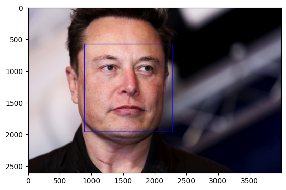
    


```python
import face_recognition
import cv2
from matplotlib import pyplot as plt

def encode_known_faces():
    # Load images of known faces
    elon_image = face_recognition.load_image_file("elon.jpg")
    robert_image = face_recognition.load_image_file("iron_man.jpg")
    # Add more images of known faces here

    # Encode known faces
    elon_encoding = face_recognition.face_encodings(elon_image)[0]
    robert_encoding = face_recognition.face_encodings(robert_image)[0]
    print("################## Encoding ####################/n",elon_encoding)
    print("################## Encoding ####################/n",robert_encoding)
    # Encode more known faces here

    # Create arrays of known face encodings and their corresponding names
    known_face_encodings = [elon_encoding,robert_encoding]
    known_face_names = ["Elon Musk","Iron Man - Robert"]  # Make sure to add more names accordingly

    return known_face_encodings, known_face_names

def recognize_faces(image_path, known_face_encodings, known_face_names):
    # Load the input image
    image = face_recognition.load_image_file(image_path)

    # Find all face locations and face encodings in the image
    face_locations = face_recognition.face_locations(image)
    face_encodings = face_recognition.face_encodings(image, face_locations)
    
    print("Giving Image Encoding")
    print("################## Encoding ####################/n",face_encodings)
    
    # Initialize an array for recognized names
    face_names = []

    for face_encoding in face_encodings:
        # Compare the face encoding with the known face encodings
        matches = face_recognition.compare_faces(known_face_encodings, face_encoding)
        name = "Unknown"

        # If a match is found, use the known face name
        if True in matches:
            match_index = matches.index(True)
            name = known_face_names[match_index]

        face_names.append(name)

    # Draw rectangles around the faces and display the names
    for (top, right, bottom, left), name in zip(face_locations, face_names):
        cv2.rectangle(image, (left, top), (right, bottom), (0, 255, 0), 8)
        cv2.putText(image, name, (left, top - 10), cv2.FONT_HERSHEY_SIMPLEX, 1, (36, 255, 12), 10)
    print("Detection Name is: ",name)
    
    
    # Display the image with faces recognized
#     cv2.imshow("Face Recognition", image)
#     cv2.waitKey(0)
#     cv2.destroyAllWindows()
    plt.imshow(image)

if __name__ == "__main__":
    # First, encode the known faces
    known_face_encodings, known_face_names = encode_known_faces()

    # Then, perform face recognition on the input image
    recognize_faces("iron_man.jpg", known_face_encodings, known_face_names)

```

    ################## Encoding ####################/n [-0.05474405  0.09901528  0.1241566   0.00264821 -0.21344182 -0.03341666
     -0.03063807 -0.18207441  0.14338571 -0.0576258   0.26655084 -0.07524312
     -0.23843548 -0.0116273   0.01982536  0.09669773 -0.1074248  -0.12256016
     -0.00501894 -0.10053775  0.06852433  0.02464913 -0.00693316 -0.04149093
     -0.11877727 -0.31602502 -0.12302428 -0.03829131  0.13136061 -0.08322924
      0.03445714  0.07750347 -0.13897331 -0.09439123  0.07031438  0.01866165
     -0.11276377 -0.09173281  0.18417974 -0.06026226 -0.1888081  -0.08012091
      0.00448392  0.19467938  0.09113618  0.0548287   0.07541551 -0.13929498
      0.09618489 -0.18462469  0.10926796  0.14791933  0.06350181  0.00768057
      0.13304196 -0.18290807 -0.00405087  0.21724239 -0.1533742   0.10205458
      0.12617995 -0.11874933 -0.01087303 -0.06593663  0.15805599  0.04400664
     -0.01326342 -0.14566652  0.2133323  -0.04443194 -0.11142903  0.1132137
     -0.10700901 -0.17943084 -0.30859166 -0.00501699  0.5098837   0.05118804
     -0.17709807 -0.00533283 -0.0077635   0.01344945  0.15684636  0.03821474
     -0.05338221 -0.09705238 -0.15268008 -0.02296404  0.20689805 -0.0676768
     -0.05301016  0.17968005 -0.00547987  0.05078281  0.04552337  0.05524134
     -0.08359936  0.01339446 -0.09383676 -0.09836838  0.09448993 -0.05811253
     -0.0258737   0.17125247 -0.1947069   0.15315706  0.02289372  0.01860685
     -0.02614888 -0.08563286 -0.05032963  0.01685279  0.1726561  -0.3036651
      0.16302355  0.15740746 -0.00400023  0.15801597  0.0175605   0.00792926
      0.02166665 -0.12385691 -0.2046084  -0.07372616  0.03094033 -0.02699156
     -0.04503476  0.05535955]
    ################## Encoding ####################/n [-0.05431071  0.01027051  0.07078883 -0.01248605 -0.04013558 -0.08359192
     -0.04556673 -0.09264778  0.13483314 -0.10769505  0.25247583 -0.00242966
     -0.24117815 -0.02970565 -0.01937623  0.12212192 -0.1356632  -0.08532277
     -0.13838637 -0.08842614 -0.06056976  0.01883886  0.12247433  0.03435862
     -0.22010678 -0.34413773 -0.14441149 -0.11154358  0.05644756 -0.06447552
     -0.04563772  0.04219426 -0.18257472 -0.10148688  0.02885335  0.07615646
     -0.0796221  -0.0881763   0.24752541  0.1415755  -0.15273798  0.01211198
      0.03957835  0.30730566  0.2342684   0.05150539  0.11425403 -0.05912963
      0.10034234 -0.26748002  0.0930147   0.08711745  0.0801874   0.0740717
      0.18017718 -0.14433375  0.05047535  0.19370458 -0.11680725  0.09379934
      0.06497239  0.01583652  0.08645853  0.00359171  0.22406903  0.02986854
     -0.12052146 -0.05036166  0.09018125 -0.15832122 -0.0272034   0.11005827
     -0.08811986 -0.16490895 -0.37078264  0.02802555  0.43720725  0.16903882
     -0.09586893  0.01880627 -0.08652435 -0.10222644  0.08488924  0.04729614
     -0.09756698 -0.00823996 -0.11265345 -0.00497997  0.23682724  0.05389332
     -0.03215324  0.20151581 -0.04683866  0.01571763  0.04471086  0.05067032
     -0.23802398 -0.04022458 -0.06986368 -0.03263003  0.00362798 -0.08927172
      0.00183542  0.07227091 -0.2055902   0.12797275 -0.06369568 -0.05813322
     -0.02595552  0.01657255 -0.14537166  0.01513408  0.13941622 -0.31558624
      0.11389145  0.21128207  0.00226721  0.10608539  0.12875158 -0.00861937
     -0.07713388  0.06024557 -0.12804104 -0.09212247 -0.00830872 -0.04158328
      0.13225797  0.01816292]
    Giving Image Encoding
    ################## Encoding ####################/n [array([-0.05431071,  0.01027051,  0.07078883, -0.01248605, -0.04013558,
           -0.08359192, -0.04556673, -0.09264778,  0.13483314, -0.10769505,
            0.25247583, -0.00242966, -0.24117815, -0.02970565, -0.01937623,
            0.12212192, -0.1356632 , -0.08532277, -0.13838637, -0.08842614,
           -0.06056976,  0.01883886,  0.12247433,  0.03435862, -0.22010678,
           -0.34413773, -0.14441149, -0.11154358,  0.05644756, -0.06447552,
           -0.04563772,  0.04219426, -0.18257472, -0.10148688,  0.02885335,
            0.07615646, -0.0796221 , -0.0881763 ,  0.24752541,  0.1415755 ,
           -0.15273798,  0.01211198,  0.03957835,  0.30730566,  0.2342684 ,
            0.05150539,  0.11425403, -0.05912963,  0.10034234, -0.26748002,
            0.0930147 ,  0.08711745,  0.0801874 ,  0.0740717 ,  0.18017718,
           -0.14433375,  0.05047535,  0.19370458, -0.11680725,  0.09379934,
            0.06497239,  0.01583652,  0.08645853,  0.00359171,  0.22406903,
            0.02986854, -0.12052146, -0.05036166,  0.09018125, -0.15832122,
           -0.0272034 ,  0.11005827, -0.08811986, -0.16490895, -0.37078264,
            0.02802555,  0.43720725,  0.16903882, -0.09586893,  0.01880627,
           -0.08652435, -0.10222644,  0.08488924,  0.04729614, -0.09756698,
           -0.00823996, -0.11265345, -0.00497997,  0.23682724,  0.05389332,
           -0.03215324,  0.20151581, -0.04683866,  0.01571763,  0.04471086,
            0.05067032, -0.23802398, -0.04022458, -0.06986368, -0.03263003,
            0.00362798, -0.08927172,  0.00183542,  0.07227091, -0.2055902 ,
            0.12797275, -0.06369568, -0.05813322, -0.02595552,  0.01657255,
           -0.14537166,  0.01513408,  0.13941622, -0.31558624,  0.11389145,
            0.21128207,  0.00226721,  0.10608539,  0.12875158, -0.00861937,
           -0.07713388,  0.06024557, -0.12804104, -0.09212247, -0.00830872,
           -0.04158328,  0.13225797,  0.01816292])]
    Detection Name is:  Iron Man - Robert
    


    
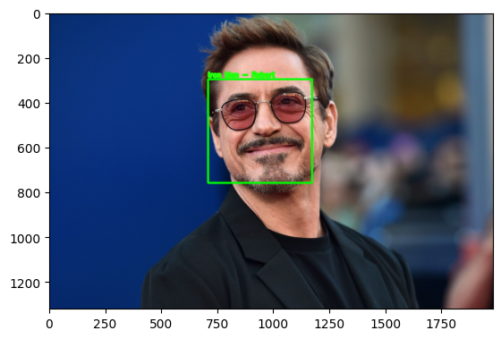
    

